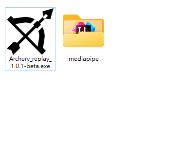

# Archery-motion-replay
The source code hasn't been made public yet because I think it's poorly written and I'm too embarrassed to show it. However, the beta version of the executable is already available for use. I'll upload the refactored code someday.  
## Demo video

Use the mouse by pressing the left button to manipulate the program on the main screen.  
Swipe left to close the program, swipe right to save the video.   
As for other features, I'll add them someday when I decide to do so...  
[Executable download link](https://drive.google.com/drive/folders/1-gOUM6oKRKoqy7Pp3mgS6r4S5K2eI7b5?usp=sharing)  

  
Please place mediapipe folder(modified a little) with Archery_replay.exe together in the same folder.

